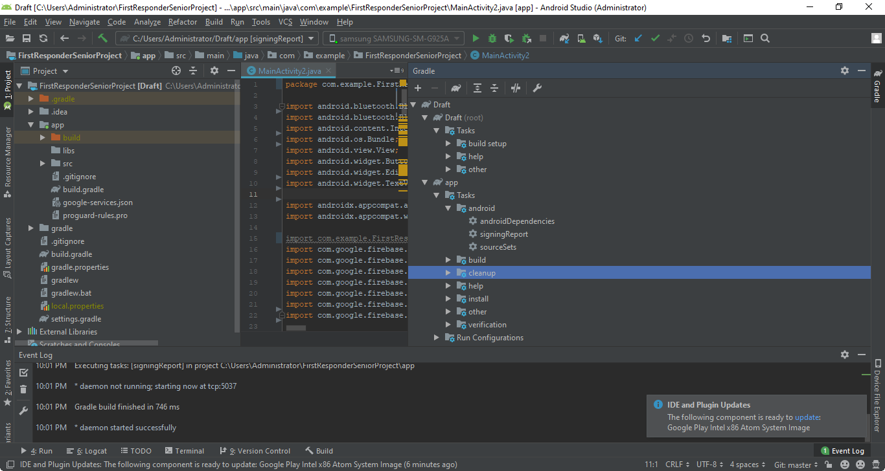
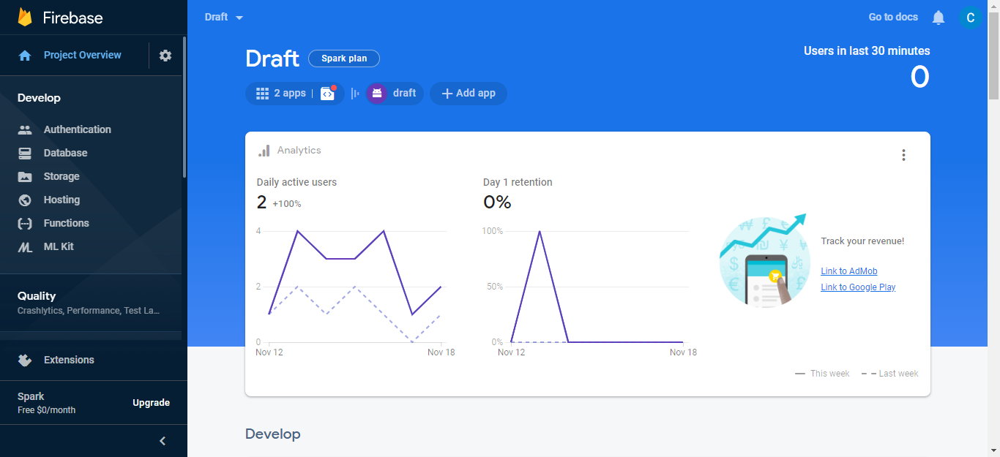
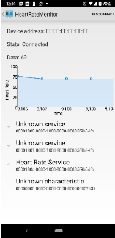
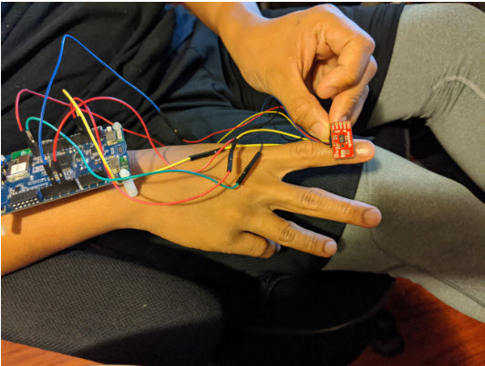
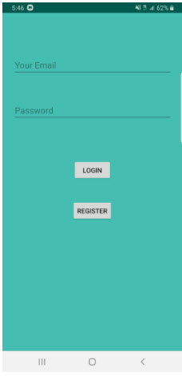
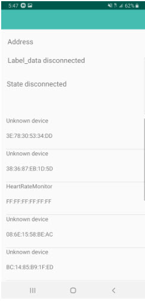
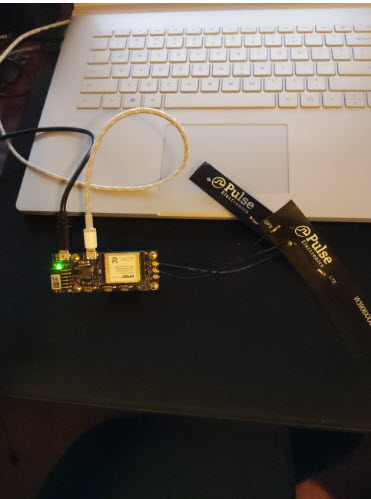

# First_Responder_Mobile_Application
Final SeniorProject
This is a README.txt file that will guide you in following and developing our prototype First Responder Smartwatch.
-----------------------------------------------------------------------------------------------------------------------------------

Hardware Components required:

1. A Heart Rate Sensor: Can be any type, in this project, the HR sensor is SPARKFUN Pulse Oximeter & HeartRate Sensor
2. Development board: DISCO-L475VG-IOT0A1, development board that has bluetooth integration into it.
3. A GPS Sensor or equivalent: In this project, the AT&T Second Generation IoT kit
-------------------------------------------------------------------------------------------------------------------------------------
Software Components required:

1. MBED STUDIO : One of the optional platforms that are able to load/download projects and develop your program.
2. MBED CLI    : A command prompt that enables the handling of projects similar to MBED STUDIO. Allows integration of plugins 				   that aren't allowed on Mbed Studio.
3. Android Studio: A free mobile development program that is able to interface with the development of the hardware via bluetooth.
4. Firebase:	 A easy to integrate database that works well with multiple platforms such as Android Studio
5. Google Cloud Platform: Creates the credentials keys to utilize some of the API such as Google Maps, may be necessary for any map activity. 
6. Optional (Arduino) : Mbed and arduino are compatibles through arduino uno. The sensor and code should work on both platforms.
-----------------------------------------------------------------------------------------------------------------------------------
The tutorial will be seperated into different sections according to the hardware components.

HEART RATE SENSOR:
In this case, the SparkFun provides some example code to use which can be altered to match the specific functionality required. In this case, the example code used is Example1_config_BPM_MODE.
Also on there website, the Library used is Sparkfun_bio_Sensor_Hub_library, both header and CPP file. 
Here are the links:
Sparkfun bio sensor:
	1. https://learn.sparkfun.com/tutorials/sparkfun-pulse-oximeter-and-heart-rate-monitor-hookup-guide/all#sparkfun-bio-sensor-arduino-library
or through their github:
	2.https://github.com/sparkfun/SparkFun_Bio_Sensor_Hub_Library

The github for the Arduino/Mbed(MBED Library still in progress of creation) code for the SparkFun will be listed soon!
Custom Library for SParkfun for Arduino listed here:
https://github.com/clarencewu94/SparkFunArduinoHeartRate

Android Studio:
Instructions:
Setup:
1. Download Android Studio from the website. 
2. Create a new project with a basic activity. Once the activity is created, the java and resource class should be created automatically. (This is to just have the initial setup done).
3. The new project requires several SDK installations and this can be done inside the SDK manager in Android Studio. Click on the Help (magnifying glass) and type in SDK manager, or just click the icon with box with a down arrow icon. This can also be accessed from the file tab in the top left corner. 
4. Once inside, go to System Settings, and click on Android SDK. There should be three options, SDK platforms, SDK Tools, and SDK Update Sites. 
In SDK platform click on the android version that you are working with. In my case, I selected Android 5,5.1,6,7,7.1.1, 9, and 10 to cover a series of android phones. Hitting apply will download those packages but will take a long time. 
In SDK Tools, the selected boxes should be Android SDK Build-Tools, Android Emulator, Android SDK Platform Tools, Adnroid SDK tools, Google Play Services, and Intel x86 Emulator Accerlarator.
Once Downloaded, the basic testing with emulators and android types are enabled. 

Project Implementation:
5. Once the setup is done, download the project from the github and open from android studio. Remember to select the project file "App" in the folder downloaded. Once it is on your android studio, it will ask to configure the gradle if not detected. Most of the files I have implemented should have the most updated gradle so once it is done, the project should be buildable. 

6. One last step, in the tools bar up top, go to firebase. This will take you to the firebase assistant. Go to Authentication and connect, as well as RealTime Database and connect to database. Notes that there will be a chance it will not work because it requires my permission and google account access so if this is the case, go to the firebase section below and make your own config using my instructions. If you need to do this step, please go to firebase section first before continuing. 

7. Assuming that the project is able to be running with database or you just came back from setting it up, Run the application with the play button and select either an emulator or an android device connected. The project implements a database already but after two-three weeks after 11/20/2019, the github will either disable these services to prevent charges. 

8. The first page will be a login page, register an account and then login to be brought to the main page. Then in the top right, there should be an Scan button. The scan button will show list of devices. If you are following the guide with the other necessary components (heart rate and GPS), then the User interface should work. Click on the Service you require and the graph layout and the extra services (takes a few seconds) should show.

9. Clicking the service and then the next characterstics, the heart rate service should begin and the graph should start moving. 

10. In case for GPS, go to the top right options again and click on the MainPage2. Once there, click on the GPS button and the Map should automatically direct you to the location you are in. Note this is real time update and is made to always go back to the user. There the application is done!.

Create a new project with a basic activity that would act as your main page. Once in, create a new activity, or individual an resource/java class. Make another project with the sample example called BLUETOOTHLEGATT. This is the premise for our bluetooth connection that requires some modification to work. 

-------------------------------------------------------------------------------------------------------
GPS(AT&T Github):
This will be posted here on my partner's github:
https://github.com/PC-Driver/SeniorProjectGPSScript

-------------------------------------------------------------------------------------------------------

Firebase/Firestore:
Go to https://firebase.google.com/ and create an firebase account. This platforms gives you NoSQL database that has a free plan and for the purposes of this project, should not exceed the amount of data used. 
After creating an account, go to the top right corner and go to "Go To console".

Click Add a project: Enter Project Name. Skipping the documents reference, proceed and click next. Enable google analytics (helps when crashing), and then select a google analytics (Default account).

Back to the overiew, click on the mobile application required, in this case android. 
Fill in the blanks, the debug signing certificate can be accessed from Android studio project, gradle tab in the right. Go to "Project Name", app, tasks, android and open signingReport. It should run and provide the SHA1 on console. 
Once the app is registered, download the config file, and place the android app in the following:

Double clicking Signing Report should output to console the SHA1 if needed in the firebase download.
SHA1:00-00-00-..etc

Top left corner of android studio, click on android with the icon next to it, select project, and then go to "Your Application", app, and placed it in App. 
Once that is done, add the Firebase SDK into the Gradle scripts: build.gradle(Module:app) in dependencies. Then run your app or go to tools, firebase, the section Authettication or Database and connect to the database (requires the config file to work).

Once the firebase is created or connected, (must use the config for connection). For the purpose of the README guide, I will simplify the tools that you will use:
In the left Tab, the tools used are:
1. Authentication
2. Database (Cloud firestore or real time database)
Here is an image to help visualization

The Authentication tab redirects you to the authentication layout. Click on Sign-in Method and allow Email and Password.
In Android Studio, login and register should be enabled and will be able to work once this method is enacted.
In the Database tab, enable both cloud firestore and real time database. 
In this project cloud firestore is set to only test the app in the account settings to create Name and set age.
If you want to modify this, use the following rules in the rule tab:
service cloud.firestore {
  match /databases/{database}/documents {
    // Allow only authenticated content owners access
    match /UserID/{documents=**} {
      allow read, write: if true
    }
    match /{documents=**}{
    	allow read, write: if false
    }
  }
}

In the realtime database, the rules should be on default:
{
  /* Visit https://firebase.google.com/docs/database/security to learn more about security rules. */
  "rules": {
    ".read": true,
    ".write": true
  }
}
The application will utilize this to store the Heart Rate data, the location and the timestamp of operations. 
Go back to the Android studio project and make sure the following are in the gradle:
    implementation 'com.jjoe64:graphview:4.2.1'
    implementation 'com.google.firebase:firebase-core:17.2.1'
    implementation 'com.google.firebase:firebase-firestore:21.2.1'
    implementation 'com.google.firebase:firebase-storage:19.1.0'
    implementation 'com.google.firebase:firebase-auth:19.1.0'

    implementation 'com.google.firebase:firebase-analytics:17.2.1'
    implementation 'com.google.firebase:firebase-database:19.2.0'
    implementation 'com.firebaseui:firebase-ui-database:6.0.2'

-------------------------------------------------------------------------------------------------------------------------------

Google Cloud Platform
For the GPS on android studio, making a maps activity or in this case downloading the Android studio project. Requires an API key. Note that the project two-three weeks from now, I will deactivate or make this project private so this is a section to learn how to use this. 

Go make a google cloud platform account. Once created go to console on the top right, click the three line tab on the top left and select API&Services, and credentials. Click on Credentials and create an API key and select the following key. The key is to be placed in two spots in android studio. One in the Android studio project such as in the Manifest and in the newly created Google_maps_xml file in App, res, values. Replace the section where it says "Your Key Here". In this case the manifest option is below and replace @string with the api key. 
     <meta-data
            android:name="com.google.android.geo.API_KEY"
            android:value="@string/google_maps_key" />

-------------------------------------------------------------------------------------------------------------------------------
Downloading the Android project should allow this to run.
NOTE: IF the project downloads, but does not get past the login screen. If it says that the android application is blocked, this is because the project has its own SHA-1 certification and you. If you have downloaded this project and expect it to work, you must go on firebase and add in the SHA-1 certification to firebase project settings for the project to work. If you are the senior project advice, you must private message me your SHA-1 certification from android studio for it to fully function. 
After implementing the Android project, and completing the other hardware components.
The end results should give you something like this:

 

Click for Video:

